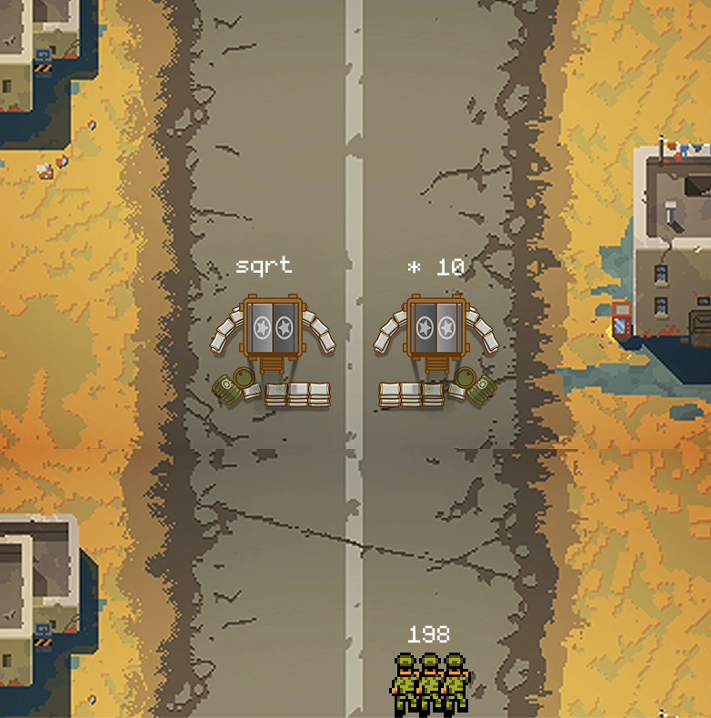

# AddVenture Army

Проект за курс CITB331 Програмиране с Python в НБУ.

## Credits

- [Font: Monogram](https://datagoblin.itch.io/monogram)
- [RPG Assets Tile Set "Military Base"](https://chasersgaming.itch.io/rpg-asset-character-soldier-sms)
- [Pixelart. Desert](https://www.artstation.com/artwork/BmdzE8)
- [Top Down Military Assets](https://2dgameartguru.com/top-down-free-game-assets/)